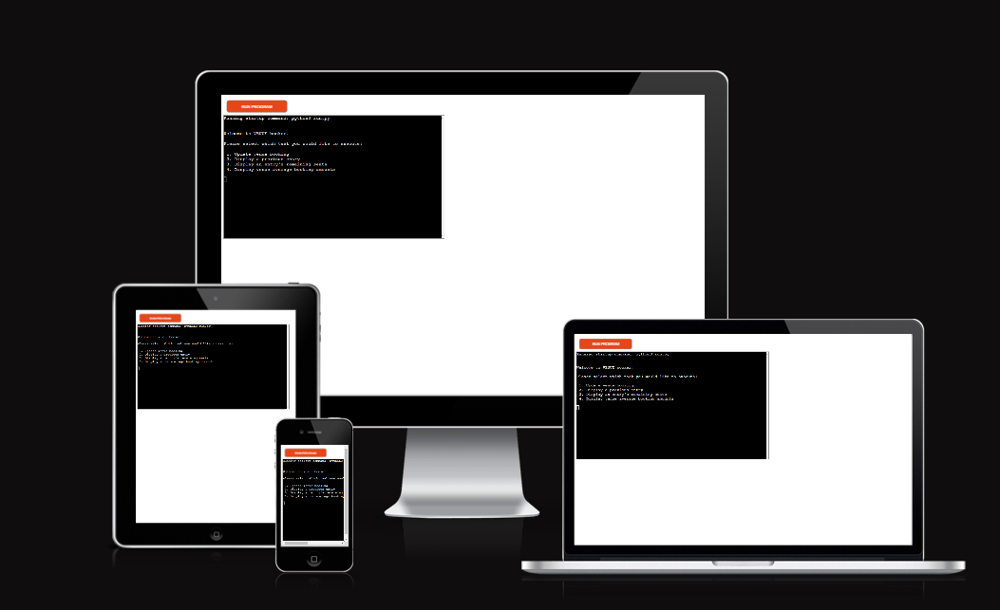

## Reminders
# VENUE Booker

VENUE-Booker is a command-line data-management application, which runs via the code institute mock terminal on Heroku. Users can input, sort, replace and view common datasets in the form of venue seat booking amounts, stored and updated externally via a google spreadsheet.

## [Live Website Link (GitHub Pages)](liam-wb.github.io/quizology/)
---

## How to use
---

Common in most business data sorting tools, the user is greeted by the option to manage or view current data. The user is given multiple choices between managing their data and what tasks they'd like the program to run, including restarting and/or stopping the program and asking for specific task execution.

## Planning
---

To start, I created an initial algorithm flowchart for how I wanted the program to work with [LucidChart](https://www.lucidchart.com/pages/landing?utm_source=google&utm_medium=cpc&utm_campaign=_chart_en_tier1_mixed_search_brand_exact_&km_CPC_CampaignId=1490375427&km_CPC_AdGroupID=55688909257&km_CPC_Keyword=lucidchart&km_CPC_MatchType=e&km_CPC_ExtensionID=&km_CPC_Network=g&km_CPC_AdPosition=&km_CPC_Creative=442433236007&km_CPC_TargetID=kwd-33511936169&km_CPC_Country=9046005&km_CPC_Device=c&km_CPC_placement=&km_CPC_target=&gclid=Cj0KCQjw_O2lBhCFARIsAB0E8B_BaaAGk7Ben2kChMf8S1KV5f3g7B3NYORCOd_w1lS_bkhpwTGKf1caAl4VEALw_wcB)

I used this as a floor plan for the app, and then added and removed features where appropriate.

### Finished program
---

The user is first given the option between adding to the current database and updating the seat bookings for each venue, or displaying a current dataset instead. 
If the user decides to add to the current data, this will automatically update the data file and automatically calculate and update the remaining seats for each venue from the data added. 

If the user decides to display data instead, they are able to pick between viewing either a set of previously input venue bookings, or the corresponding set of data for the seats that remained available for that data submission. Furthermore, the user is given the option to view a the previous booking, multiple bookings, all bookings, or the specific one the user inputs. 

Lastly, the user is given the option to check each venue's current average bookings as with business would require a way to see trends and changes in popularity. Unless the user types exit after a task, the user will be given the option to return to the initial task selection, and all data input is validated to ensure a smooth process and efficiency in the functions.

## Features
---

### Existing Features

 - Multiple choice data management
    - Simple, straigtforward choices / instructions
    - User input validation, returns error, what user typed and what counts as valid input
    - Program will return same error messages until the user inputs the correct data type

    

 - Updates external google sheet with user inputs (booking datasets for individual venues)
    - Automatically calculates remaining seats from input dataset
    - Automatically updates seperate sheet in the spreadsheet for remaining seats

    

 - User is given the option on what data they would like to pull from the external file as well as how much data
    - User is given the option to pick a specific dataset to pull from the spreadsheet if they prefer
    - Program can display any value in the spreadsheet

    
    

 - User is given the option to review mean average of each venue

 - User has the option to input to go back to the beginning of the program, or exit the program after each task

    

 ### Future Features

  - Sheet for ticket prices / seat types and prices to monitor venue income
  - Allow user to change individual venue values
  - Leaving dates on each dataset update

## Data Model
---

I decided to create functions for each of the task processes including:

 - Collecting user inputs
    - Using if statements to dictate what function will be called next
 - Validating user inputs
    - Using While loops to insure that the function only moves on when correct data is input
 
 - Update functions also use parameters (like worksheet names) to avoid long code, and create a more efficient and smooth user experience

 I also used many other tools in Python such as:

 - Implementation of the gspread library, to connect an external file to the program
 - Most functions used aggregated data such as lists, dictionaries to sort items in a more organised fashion
 - Many functions used various print statements
 - Some functions also used many forms of list iteration and comprehension to convert and organise data to be made easily readable to the viewer
 - I also avoided the use of any "loose" variables and kept them strictly in the functions to make the source code easily understandable (excluding global variables and to call the main program function)

## Testing
---

I've tested the project in the Heroku terminal and my local terminal, validated my code through python validators, and rigorously tested the validation and program function order to ensure that the code runs and validates as intended.

## Bugs

### Solved Bugs

 - Midway through the project development I noticed that some of my functions would not be able to run efficiently by having parameters passed to it as planned, so I ended up changing some task execution processes to run within the general_functions function instead. An example of this is the collect_welcome function, which was passed to the general_functions function as the variable "datas".

 - I had issues with gspread not staying installed the next time I re-opened the program. Although I have not found a permanent fix for this, the program runs fine after using pip3 install gspread each time I reopened the workspace.

 - I found an issue where when initiating the input for if the user wanted to pull up a specific sheet value, the program would return "None" as a result of the function being ordered right after the input validation function. This is because the input validation function is supposed to take the user input adn return it to the general_functions function to be printed for the next function in the sequence. This was resolved by using an if statement to make sure that the value was only returned if it was not "None".

### Remaining bugs

 - No bugs remaining

### Validator testing

 - [PEP8 checker](https://www.pythonchecker.com/)
    - No major issues found.

## Deployment
---

This project was deployed using Code Institute's mock terminal on Heroku

 - Steps for deployment:
    - Fork / clone repository
    - Create new Heroku app
    - Configure vars
    - Set the buildbacks in order Python, Node.JS
    - Link the app to the repository
    - Deploy to main branch

## Credits / Referencing
---

 - Code institute for the deployment terminal
 - Google spreadsheets / cloud for the external tools / API
 - Google for inspiration on various business apps
 - LucidCharts for the flowchart creation
 - PEP8 checker for code validation
